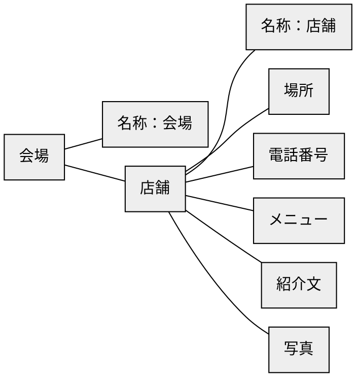
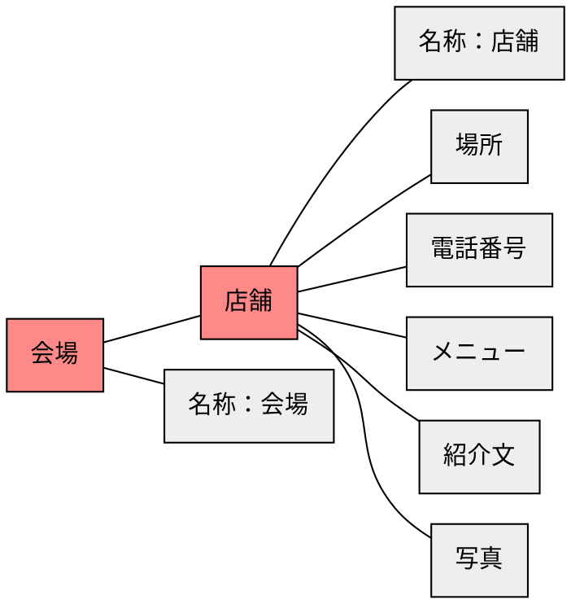
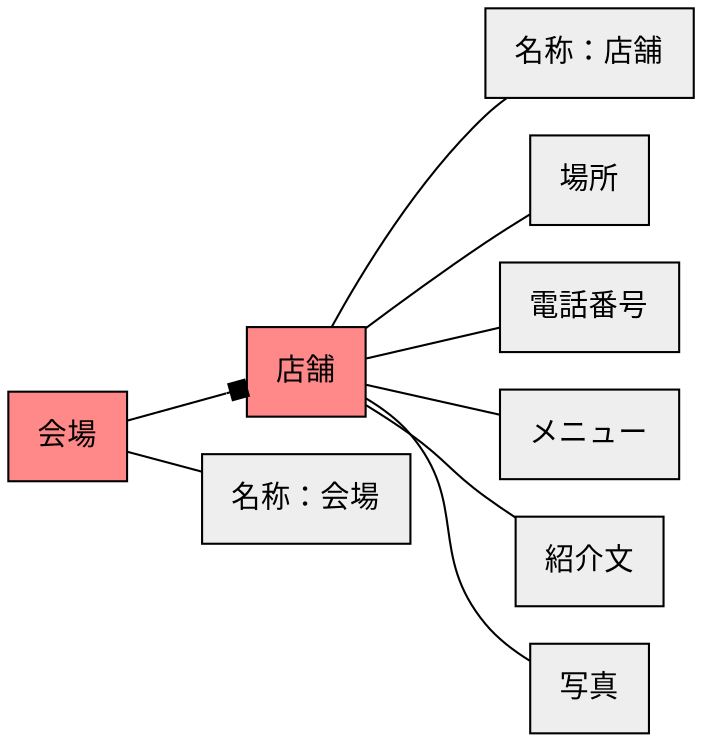
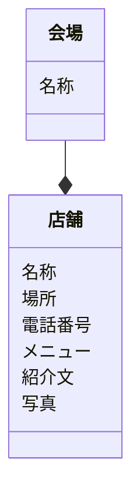

# ステップ1：オブジェクトの抽出

## タスクを揃える
- 花屋「ソラリス」のブースの場所を確認する
- B会場の出店を確認する
- タイ料理屋「チェンマイ」の名称を変更する
- 写真室「モモ」の電話番号を確認する
- バー「セブン」のメニューを確認する
- 店の紹介文を確認する
- レストラン「カルデラ」の写真を変更する


## 「名詞」を抽出する
- **花屋「ソラリス」** の **ブースの場所**を確認する
- **B会場** の **出店**を確認する
- **タイ料理屋「チェンマイ」** の **名称**を変更する
- **写真室「モモ」** の **電話番号**を確認する
- **バー「セブン」** の **メニュー**を確認する
- **店**の**紹介文**を確認する
- **レストラン「カルデラ」** の **写真**を変更する


## 「名詞」とそれらの関係を抽出する
``花屋「ソラリス」``ー``ブースの場所``
``B会場``ー``出店``
``タイ料理屋「チェンマイ」``ー``名称``
``写真室「モモ」``ー``電話番号``
``バー「セブン」``ー``メニュー``
``店``ー``紹介文``
``レストラン「カルデラ」``ー``写真``


## 「名詞」を汎化し、粒度を揃える
``店舗``ー``場所``
``会場``ー``店舗``
``店舗``ー``名称``
``店舗``ー``電話番号``
``店舗``ー``メニュー``
``店舗``ー``紹介文``
``店舗``ー``写真``


## 「名詞」の関係性をつなげ、オブジェクトを特定する



## オブジェクトの中で「メインオブジェクト」になるものを特定する



## オブジェクトの多重性を特定する



## メインオブジェクトに付随するオブジェクトをプロパティとする



## タスクからアクションを見つける
```mermaid
classDiagram
  class 会場 {
    名称
    (新規)
    (削除)
    (名称変更)
    (店舗追加)
    (店舗削除)
  }
  class 店舗 {
    名称
    場所
    電話番号
    メニュー
    紹介文
    写真
    (新規)
    (削除)
    (名称変更)
    (場所変更)
    (電話番号変更)
    (メニュー変更)
    (紹介文変更)
    (写真変更)
  }
  会場 --* 店舗
```
