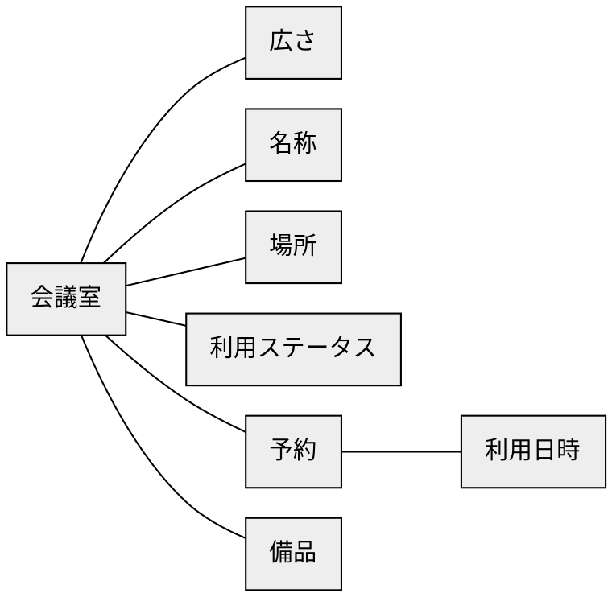
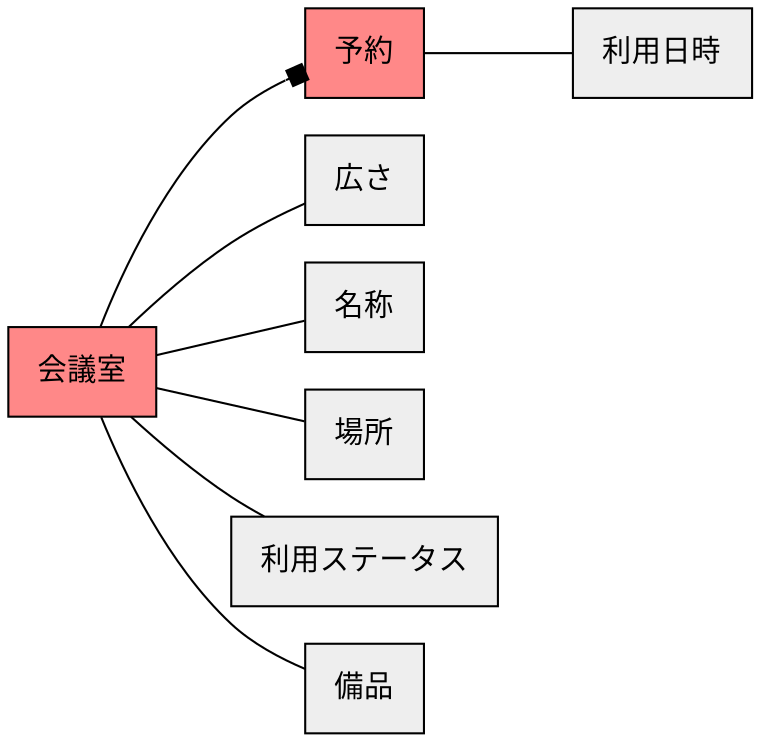
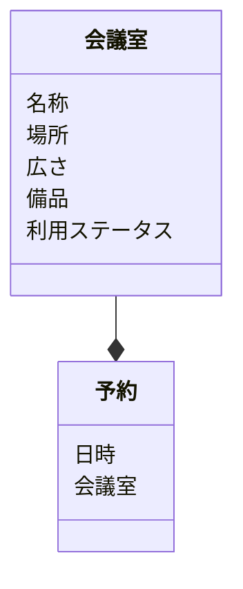

# ステップ1：オブジェクトの抽出

## タスクを揃える
- ミーティングルーム「ユーカリ」の広さを確認する
- 会議室を新規登録する
- 会議室「ブルーベリー」が何階にあるかを確認する
- ある会議室の現在の利用ステータスを確認する
- 会議室「スグリ」の予約状況を確認する
- 会議室「コデマリ」の予約をする
- 大会議室のディスプレイの有無を確認する
- 会議室「リモニューム」の名称を変更する
- ある予約の「部屋名と利用日時を確認する」


## 「名詞」を抽出する
- **ミーティングルーム「ユーカリ」** の**広さ**を確認する
- **会議室**を新規登録する
- **会議室「ブルーベリー」** が**何階**にあるかを確認する
- **ある会議室** の現在の**利用ステータス**を確認する
- **会議室「スグリ」** の**予約状況**を確認する
- **会議室「コデマリ」** の**予約**をする
- **大会議室**の**ディスプレイ**の有無を確認する
- **会議室「リモニューム」** の**名称**を変更する
- **ある予約**の「**部屋名**と**利用日時**を確認する」


## 「名詞」とそれらの関係を抽出する
``ミーティングルーム「ユーカリ」``ー``広さ``
``会議室``
``会議室``ー``「ブルーベリー」``ー``何階``
``ある会議室``ー``利用ステータス``
``会議室``ー``「スグリ」``ー``予約状況``
``会議室``ー``「コデマリ」``ー``予約``
``大会議室``ー``ディスプレイ``
``会議室``ー``「リモニューム」``ー``名称``
``ある予約``ー``部屋名``ー``利用日時``


## 「名詞」を汎化し、粒度を揃える
``会議室``ー``広さ``
``会議室``
``会議室``ー``名称``ー``場所``
``会議室``ー``利用ステータス``
``会議室``ー``名称``ー``予約``
``会議室``ー``広さ``ー``備品``
``会議室``ー``名称``ー``名称``
``予約``ー``会議室``ー``名称``ー``利用日時``


## 「名詞」の関係性をつなげ、オブジェクトを特定する



## オブジェクトの中で「メインオブジェクト」になるものを特定する


## オブジェクトの多重性を特定する



## メインオブジェクトに付随するオブジェクトをプロパティとする



## タスクからアクションを見つける
```mermaid
classDiagram
  class 会議室 {
    名称
    場所
    広さ
    備品
    利用ステータス
    (追加)
    (削除)
    (名称・場所・広さ・備品の変更)
    (利用ステータスを調べる)
  }
  class 予約 {
    日時
    会議室
    (追加)
    (削除)
    (日時・会議室の変更)
  }
  会議室 --* 予約
```
