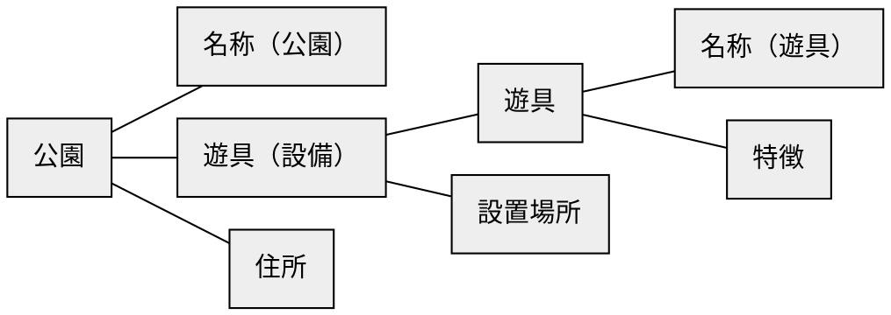
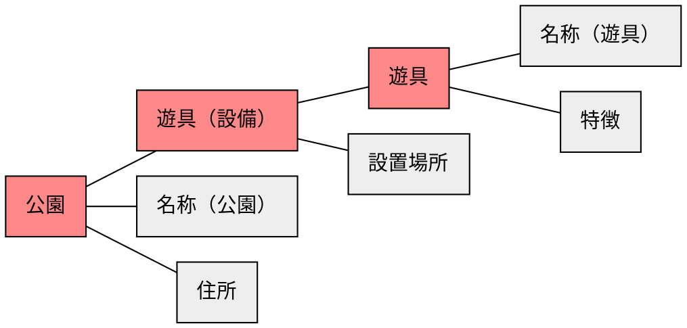
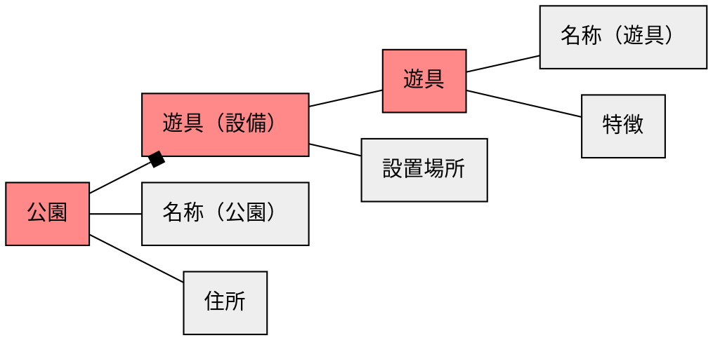
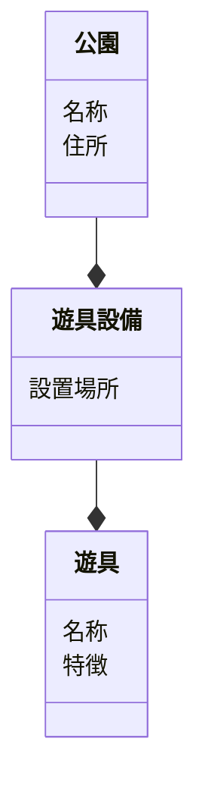

# ステップ1：オブジェクトの抽出

## タスクを揃える
- すみれ山公園の滑り台の設置場所を確認する
- ブランコのある公園を確認する
- 滑り台の一般的な特徴を確認する
- 公園の住所を確認する


## 「名詞」を抽出する
- **すみれ山公園**の**滑り台**の**設置場所**を確認する
- **ブランコ**のある**公園**を確認する
- **滑り台**の**一般的な特徴**を確認する
- **公園**の**住所**を確認する


## 「名詞」とそれらの関係を抽出する
``すみれ山``ー``公園``ー``滑り台``ー``設置場所``
``ブランコ``ー``公園``
``滑り台``ー``一般的な特徴``
``公園``ー``住所``


## 「名詞」を汎化し、粒度を揃える
``名称``ー``公園``ー``遊具（設備）``ー``設置場所``
``遊具``ー``公園``
``遊具``ー``特徴``
``公園``ー``住所``


## 「名詞」の関係性をつなげ、オブジェクトを特定する



## オブジェクトの中で「メインオブジェクト」になるものを特定する



## オブジェクトの多重性を特定する



## メインオブジェクトに付随するオブジェクトをプロパティとする



## タスクからアクションを見つける
```mermaid
classDiagram
  class 公園 {
    名称
    住所
    (追加)
    (削除)
    (名称・住所の変更)
  }
  class 遊具設備 {
    設置場所
    (追加)
    (削除)
    (設置場所の変更)
  }
  class 遊具 {
    名称
    特徴
    (追加)
    (削除)
    (名称・特徴の変更)
  }
  公園 --* 遊具設備
  遊具設備 --* 遊具
```
