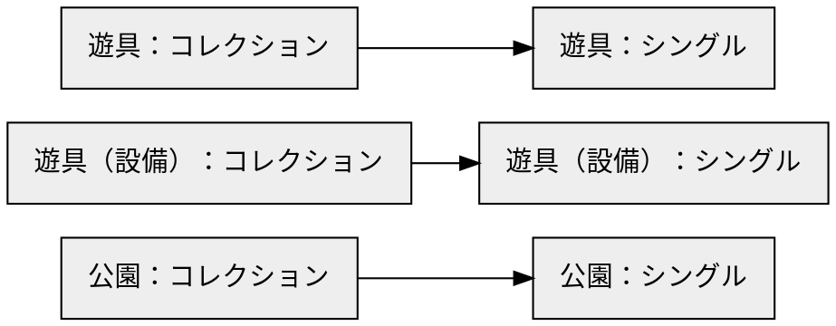
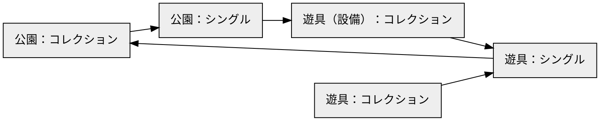

# ステップ2：ビューとナビゲーションの検討

## メインオブジェクトに「コレクション」と「シングル」のビューを与える

```dot
digraph {
  graph [
    rankdir = LR,
  ];
  node [
    shape = box,
    style = "filled",
    fillcolor = "#eeeeee",
    margin = 0.2
  ];

  公園：コレクション -> 公園：シングル [dir = forward];
  遊具（設備）：コレクション -> 遊具（設備）：シングル [dir = forward];
  遊具：コレクション -> 遊具：シングル [dir = forward];
}
```

## コレクションとシングルビューの呼び出し関係を検討する

```dot
digraph {
  graph [
    rankdir = LR,
  ];
  node [
    shape = box,
    style = "filled",
    fillcolor = "#eeeeee",
    margin = 0.2
  ];

  公園：コレクション -> 公園：シングル [dir = forward];
  公園：シングル -> 遊具（設備）：コレクション [dir = forward];
  遊具（設備）：コレクション -> 遊具：シングル [dir = forward];
  遊具：コレクション -> 遊具：シングル [dir = forward];
  遊具：シングル -> 公園：コレクション [dir = forward];
}
```

## メインオブジェクトの中からルートナビゲーション項目を選定する
- 公園：コレクション
- 遊具：コレクション
