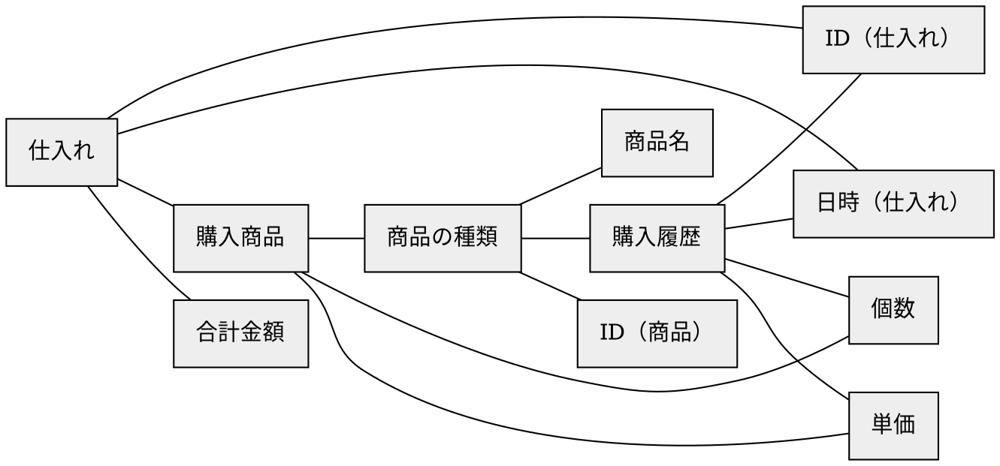
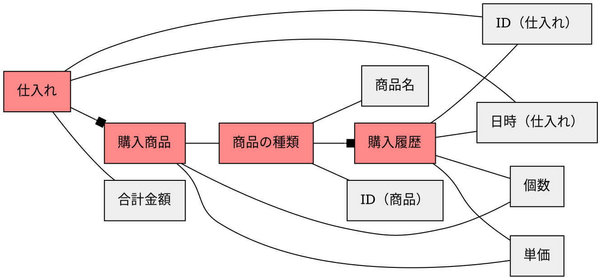
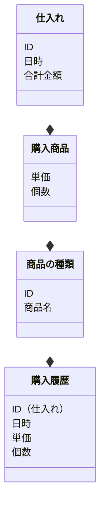

# ステップ1：オブジェクトの抽出

## タスクを揃える
- ある仕入れの仕入れIDと日付と合計金額を確認する
- 商品「カーボンペンC2-W」の商品IDと過去の購入を確認する
- ある仕入れで購入した全商品の商品名、単価、個数を確認する


## 「名詞」を抽出する
- **ある仕入れ**の**仕入れID**と**日付**と**合計金額**を確認する
- **商品**「**カーボンペンC2W**」の**商品ID**と**過去**の**購入**を確認する
- **ある仕入れ**で**購入**した**全商品**の**商品名**、**単価**、**個数**を確認する


## 「名詞」とそれらの関係を抽出する
``ある仕入れ``ー``仕入れID``
``ある仕入れ``ー``日付``
``ある仕入れ``ー``合計金額``
``商品``ー``カーボンペンC2W``
``商品``ー``商品ID``
``商品``ー``購入``ー``過去``
``ある仕入れ``ー``購入``
``ある仕入れ``ー``全商品``
``全商品``ー``商品名``
``全商品``ー``単価``
``全商品``ー``個数``


## 「名詞」を汎化し、粒度を揃える
``仕入れ``ー``仕入れID``
``仕入れ``ー``日付``
``仕入れ``ー``合計金額``
``商品の種類``ー``商品名``
``商品の種類``ー``商品ID``
``商品の種類``ー``購入履歴``ー``日時``
``仕入れ``ー``購入商品``
``購入商品``ー``商品名``
``購入商品``ー``単価``
``購入商品``ー``個数``


## 「名詞」の関係性をつなげ、オブジェクトを特定する



## オブジェクトの中で「メインオブジェクト」になるものを特定する


## オブジェクトの多重性を特定する



## メインオブジェクトに付随するオブジェクトをプロパティとする



## タスクからアクションを見つける
```mermaid
classDiagram
  class 仕入れ {
    ID
    日時
    合計金額
    (追加)
    (削除)
    (日時の変更)
    (合計金額の算出)
  }
  class 購入商品 {
    単価
    個数
    (追加)
    (削除)
    (単価・個数・商品の種類の変更)
  }
  class 商品の種類 {
    ID
    商品名
    (追加)
    (削除)
    (商品名の変更)
  }
  class 購入履歴 {
    ID（仕入れ）
    日時
    単価
    個数
    (ID（仕入れ）・日時・単価・個数の表示)
  }
  仕入れ --* 購入商品
  購入商品 --* 商品の種類
  商品の種類 --* 購入履歴
```
