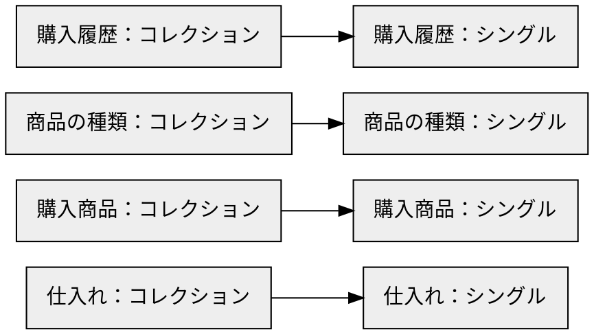
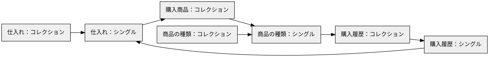

# ステップ2：ビューとナビゲーションの検討

## メインオブジェクトに「コレクション」と「シングル」のビューを与える

```dot
digraph {
  graph [
    rankdir = LR,
  ];
  node [
    shape = box,
    style = "filled",
    fillcolor = "#eeeeee",
    margin = 0.2
  ];

  仕入れ：コレクション -> 仕入れ：シングル [dir = forward];
  購入商品：コレクション -> 購入商品：シングル [dir = forward];
  商品の種類：コレクション -> 商品の種類：シングル [dir = forward];
  購入履歴：コレクション -> 購入履歴：シングル [dir = forward];
}
```

## コレクションとシングルビューの呼び出し関係を検討する

```dot
digraph {
  graph [
    rankdir = LR,
  ];
  node [
    shape = box,
    style = "filled",
    fillcolor = "#eeeeee",
    margin = 0.2
  ];

  仕入れ：コレクション -> 仕入れ：シングル [dir = forward];
  仕入れ：シングル -> 購入商品：コレクション [dir = forward];
  購入商品：コレクション -> 商品の種類：シングル [dir = forward];
  商品の種類：コレクション -> 商品の種類：シングル [dir = forward];
  商品の種類：シングル -> 購入履歴：コレクション [dir = forward];
  購入履歴：コレクション -> 購入履歴：シングル [dir = forward];
  購入履歴：シングル -> 仕入れ：シングル [dir = forward];
}
```

## メインオブジェクトの中からルートナビゲーション項目を選定する
- 仕入れ：コレクション
- 商品の種類：コレクション
