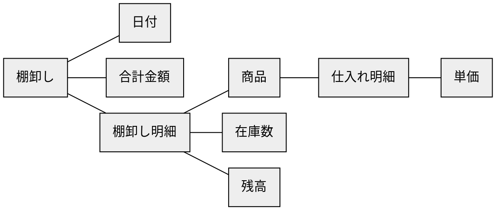
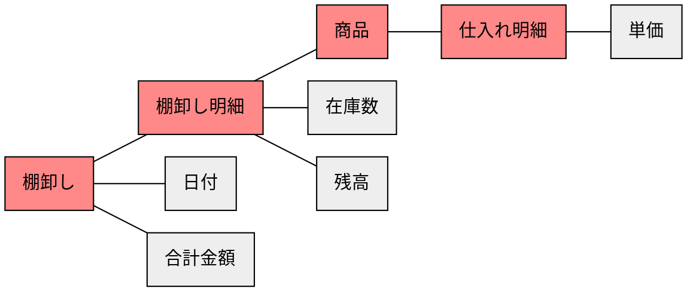
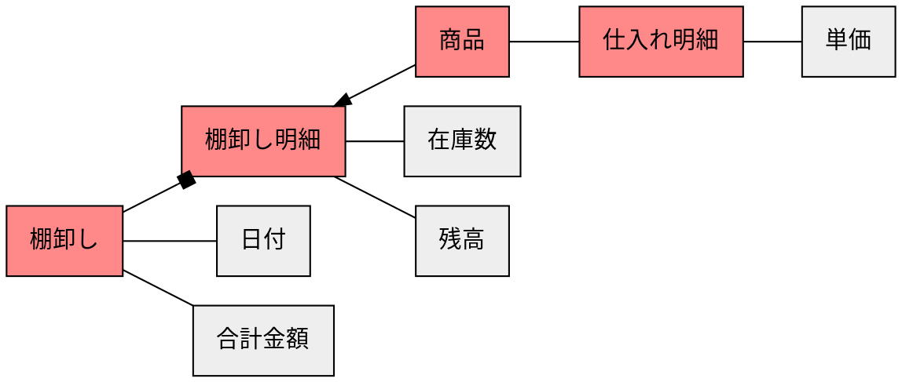
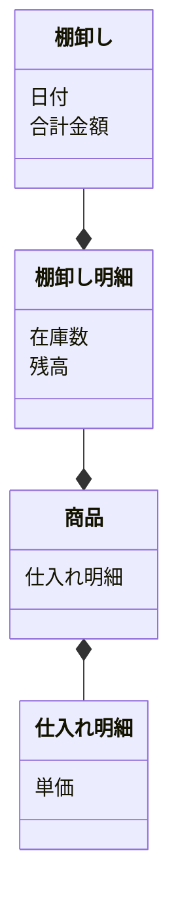

# ステップ1：オブジェクトの抽出

## タスクを揃える
- ある棚卸しの日付と合計金額を確認する
- ある商品の2019年12月31日の棚卸し時の在庫数を確認する
- ある棚卸しで調べた全商品の商品名、個数を確認する
- ある棚卸しで調べた商品の残高（直近の仕入れ単価に在庫数をかけた金額）を確認する


## 「名詞」を抽出する
- **ある棚卸し**の**日付**と**合計金額**を確認する
- **ある商品**の**2019年12月31日**の**棚卸し**時の**在庫数**を確認する
- **ある棚卸し**で調べた**全商品**の**商品名**、**個数**を確認する
- **ある棚卸し**で調べた**商品**の**残高**（**直近の仕入れ単価**に**在庫数**をかけた金額）を確認する


## 「名詞」とそれらの関係を抽出する
``ある棚卸し``ー``日付``
``ある棚卸し``ー``合計金額``
``棚卸し``ー``2019年12月31日``
``棚卸し``ー``ある商品``
``ある商品``ー``在庫数``
``ある棚卸し``ー``全商品``
``全商品``ー``商品名``
``全商品``ー``個数``
``ある棚卸し``ー``商品``
``商品``ー``残高``
``商品``ー``直近の仕入れ``
``商品``ー``在庫数``
``直近の仕入れ``ー``単価``


## 「名詞」を汎化し、粒度を揃える
``棚卸し``ー``日付``
``棚卸し``ー``合計金額``
``棚卸し``ー``日付``
``棚卸し``ー``棚卸し明細``
``棚卸し明細``ー``在庫数``
``棚卸し``ー``棚卸し明細``
``棚卸し明細``ー``商品``
``棚卸し明細``ー``在庫数``
``棚卸し``ー``棚卸し明細``
``棚卸し明細``ー``残高``
``商品``ー``仕入れ``
``棚卸し明細``ー``在庫数``
``仕入れ``ー``単価``


## 「名詞」の関係性をつなげ、オブジェクトを特定する



## オブジェクトの中で「メインオブジェクト」になるものを特定する



## オブジェクトの多重性を特定する



## メインオブジェクトに付随するオブジェクトをプロパティとする



## タスクからアクションを見つける
```mermaid
classDiagram
  class 棚卸し {
    日付
    合計金額
    (追加)
    (削除)
    (日付の変更)
    (合計金額の算出)
  }
  class 棚卸し明細 {
    在庫数
    残高
    (追加)
    (削除)
    (商品の変更)
    (在庫数・残高の算出)
  }
  class 商品 {
    仕入れ明細
  }
  class 仕入れ明細 {
    単価
  }
  棚卸し --* 棚卸し明細
  棚卸し明細 --* 商品
  商品 *-- 仕入れ明細
```
