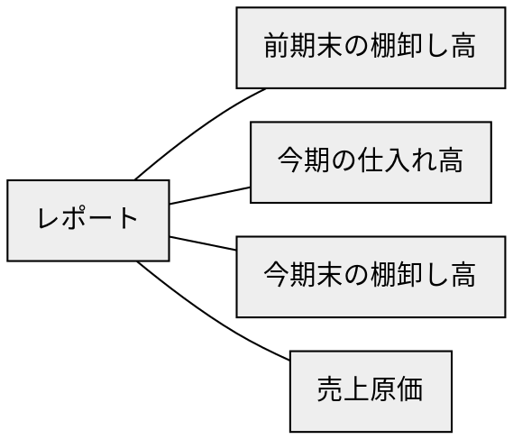
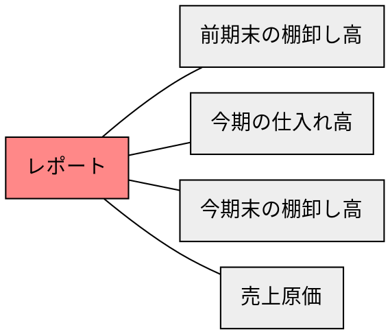
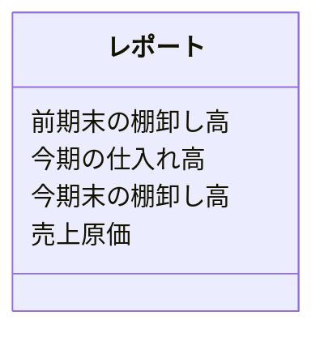

# ステップ1：オブジェクトの抽出

## タスクを揃える
- 前期末の棚卸し高、今期の仕入れ高、今期末の棚卸し高を確認する（今期は2019年、前期は2018年）
- 2019年の売上原価（前期末の棚卸し高と今期の仕入れ高を合計し、今期末の棚卸し高を引いたもの）を計算する


## 「名詞」を抽出する
- **前期末の棚卸し高**、**今期の仕入れ高**、**今期末の棚卸し高**を確認する（今期は2019年、前期は2018年）
- 2019年の**売上原価**（**前期末の棚卸し高**と**今期の仕入れ高**を合計し、**今期末の棚卸し高**を引いたもの）を計算する


## 「名詞」とそれらの関係を抽出する
``前期末の棚卸し高``
``今期の仕入れ高``
``今期末の棚卸し高``
``売上原価``
``前期末の棚卸し高``
``今期の仕入れ高``
``今期末の棚卸し高``


## 「名詞」を汎化し、粒度を揃える
``前期末の棚卸し高``
``今期の仕入れ高``
``今期末の棚卸し高``
``売上原価``
``前期末の棚卸し高``
``今期の仕入れ高``
``今期末の棚卸し高``


## 「名詞」の関係性をつなげ、オブジェクトを特定する



## オブジェクトの中で「メインオブジェクト」になるものを特定する



## オブジェクトの多重性を特定する


## メインオブジェクトに付随するオブジェクトをプロパティとする



## タスクからアクションを見つける
```mermaid
classDiagram
  class レポート {
    前期末の棚卸し高
    今期の仕入れ高
    今期末の棚卸し高
    売上原価
    (前期末の棚卸し高・今期の仕入れ高・今期末の棚卸し高・売上原価を計算する)
  }
```
