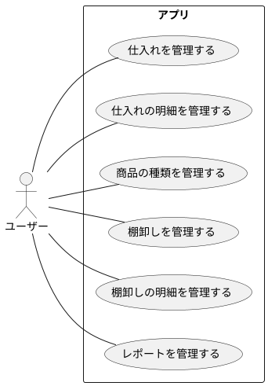
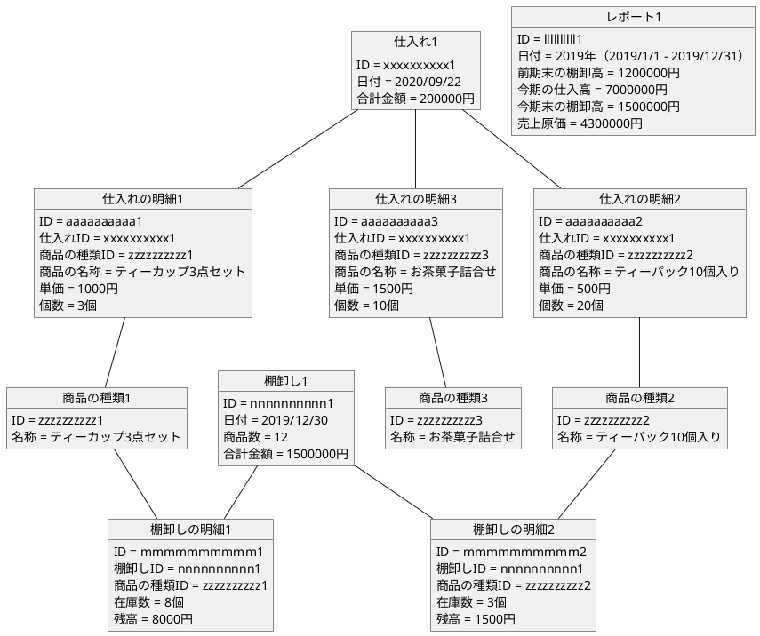
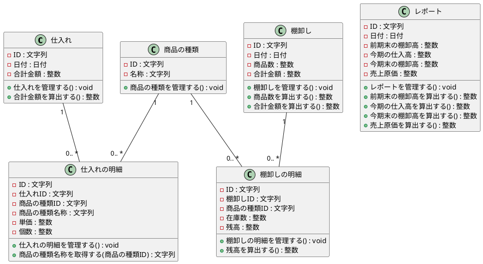
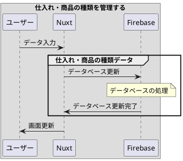
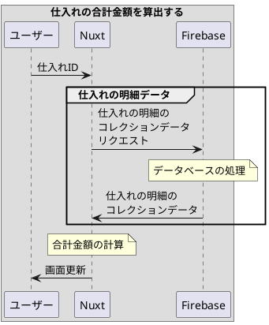
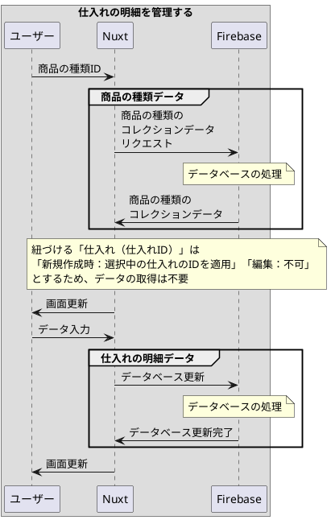
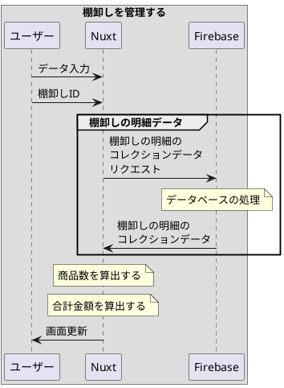
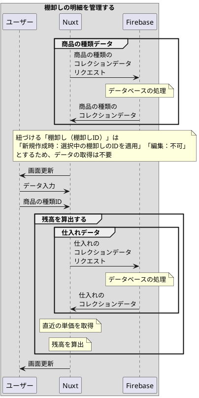
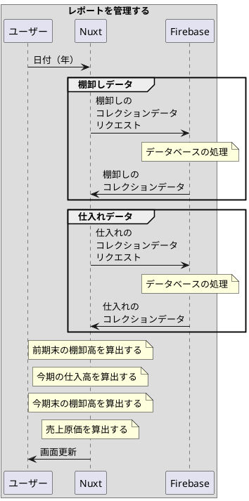
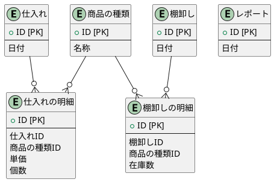

# 実装用の図

## ユースケース図

```puml
@startuml
left to right direction
actor ユーザー as user
rectangle アプリ {
  usecase "仕入れを管理する" as case1
  usecase "仕入れの明細を管理する" as case2
  usecase "商品の種類を管理する" as case3
  usecase "棚卸しを管理する" as case4
  usecase "棚卸しの明細を管理する" as case5
  usecase "レポートを管理する" as case6
}
user -- case1
user -- case2
user -- case3
user -- case4
user -- case5
user -- case6
@enduml
```

## オブジェクト図

```puml
@startuml
object 仕入れ1
仕入れ1 : ID = xxxxxxxxxx1
仕入れ1 : 日付 = 2020/09/22
仕入れ1 : 合計金額 = 200000円

object 仕入れの明細1
仕入れの明細1 : ID = aaaaaaaaaa1
仕入れの明細1 : 仕入れID = xxxxxxxxxx1
仕入れの明細1 : 商品の種類ID = zzzzzzzzzz1
仕入れの明細1 : 商品の名称 = ティーカップ3点セット
仕入れの明細1 : 単価 = 1000円
仕入れの明細1 : 個数 = 3個

object 仕入れの明細2
仕入れの明細2 : ID = aaaaaaaaaa2
仕入れの明細2 : 仕入れID = xxxxxxxxxx1
仕入れの明細2 : 商品の種類ID = zzzzzzzzzz2
仕入れの明細2 : 商品の名称 = ティーパック10個入り
仕入れの明細2 : 単価 = 500円
仕入れの明細2 : 個数 = 20個

object 仕入れの明細3
仕入れの明細3 : ID = aaaaaaaaaa3
仕入れの明細3 : 仕入れID = xxxxxxxxxx1
仕入れの明細3 : 商品の種類ID = zzzzzzzzzz3
仕入れの明細3 : 商品の名称 = お茶菓子詰合せ
仕入れの明細3 : 単価 = 1500円
仕入れの明細3 : 個数 = 10個

object 商品の種類1
商品の種類1 : ID = zzzzzzzzzz1
商品の種類1 : 名称 = ティーカップ3点セット

object 商品の種類2
商品の種類2 : ID = zzzzzzzzzz2
商品の種類2 : 名称 = ティーパック10個入り

object 商品の種類3
商品の種類3 : ID = zzzzzzzzzz3
商品の種類3 : 名称 = お茶菓子詰合せ

object 棚卸し1
棚卸し1 : ID = nnnnnnnnnn1
棚卸し1 : 日付 = 2019/12/30
棚卸し1 : 商品数 = 12
棚卸し1 : 合計金額 = 1500000円

object 棚卸しの明細1
棚卸しの明細1 : ID = mmmmmmmmmm1
棚卸しの明細1 : 棚卸しID = nnnnnnnnnn1
棚卸しの明細1 : 商品の種類ID = zzzzzzzzzz1
棚卸しの明細1 : 在庫数 = 8個
棚卸しの明細1 : 残高 = 8000円

object 棚卸しの明細2
棚卸しの明細2 : ID = mmmmmmmmmm2
棚卸しの明細2 : 棚卸しID = nnnnnnnnnn1
棚卸しの明細2 : 商品の種類ID = zzzzzzzzzz2
棚卸しの明細2 : 在庫数 = 3個
棚卸しの明細2 : 残高 = 1500円

object レポート1
レポート1 : ID = llllllllll1
レポート1 : 日付 = 2019年（2019/1/1 - 2019/12/31）
レポート1 : 前期末の棚卸高 = 1200000円
レポート1 : 今期の仕入高 = 7000000円
レポート1 : 今期末の棚卸高 = 1500000円
レポート1 : 売上原価 = 4300000円

仕入れ1 -- 仕入れの明細1
仕入れ1 -- 仕入れの明細2
仕入れ1 -- 仕入れの明細3
仕入れの明細1 -- 商品の種類1
仕入れの明細2 -- 商品の種類2
仕入れの明細3 -- 商品の種類3
棚卸し1 -- 棚卸しの明細1
棚卸し1 -- 棚卸しの明細2
商品の種類1 -- 棚卸しの明細1
商品の種類2 -- 棚卸しの明細2
@enduml
```

## クラス図

```puml
@startuml
class 仕入れ {
  - ID : 文字列
  - 日付 : 日付
  - 合計金額 : 整数
  + 仕入れを管理する() : void
  + 合計金額を算出する() : 整数
}
class 仕入れの明細 {
  - ID : 文字列
  - 仕入れID : 文字列
  - 商品の種類ID : 文字列
  - 商品の種類名称 : 文字列
  - 単価 : 整数
  - 個数 : 整数
  + 仕入れの明細を管理する() : void
  + 商品の種類名称を取得する(商品の種類ID) : 文字列
}
class 商品の種類 {
  - ID : 文字列
  - 名称 : 文字列
  + 商品の種類を管理する() : void
}
class 棚卸し {
  - ID : 文字列
  - 日付 : 日付
  - 商品数 : 整数
  - 合計金額 : 整数
  + 棚卸しを管理する() : void
  + 商品数を算出する() : 整数
  + 合計金額を算出する() : 整数
}
class 棚卸しの明細 {
  - ID : 文字列
  - 棚卸しID : 文字列
  - 商品の種類ID : 文字列
  - 在庫数 : 整数
  - 残高 : 整数
  + 棚卸しの明細を管理する() : void
  + 残高を算出する() : 整数
}
class レポート {
  - ID : 文字列
  - 日付 : 日付
  - 前期末の棚卸高 : 整数
  - 今期の仕入高 : 整数
  - 今期末の棚卸高 : 整数
  - 売上原価 : 整数
  + レポートを管理する() : void
  + 前期末の棚卸高を算出する() : 整数
  + 今期の仕入高を算出する() : 整数
  + 今期末の棚卸高を算出する() : 整数
  + 売上原価を算出する() : 整数
}
仕入れ "1" -- "0.. *" 仕入れの明細
商品の種類 "1" -- "0.. *" 仕入れの明細
棚卸し "1" -- "0.. *" 棚卸しの明細
商品の種類 "1" -- "0.. *" 棚卸しの明細
@enduml
```

## シーケンス図

```puml
@startuml
box 仕入れ・商品の種類を管理する
participant ユーザー
participant Nuxt
participant Firebase as FB

ユーザー -> Nuxt : データ入力

group 仕入れ・商品の種類データ
Nuxt -> FB : データベース更新
note over FB : データベースの処理
FB -> Nuxt : データベース更新完了
end

Nuxt -> ユーザー : 画面更新
end box
@enduml
```

```puml
@startuml
box 仕入れの合計金額を算出する
participant ユーザー
participant Nuxt
participant Firebase as FB

ユーザー -> Nuxt : 仕入れID

group 仕入れの明細データ
Nuxt -> FB : 仕入れの明細の\nコレクションデータ\nリクエスト
note over FB : データベースの処理
FB -> Nuxt : 仕入れの明細の\nコレクションデータ
end

note over Nuxt : 合計金額の計算

Nuxt -> ユーザー : 画面更新
end box
@enduml
```

```puml
@startuml
box 仕入れの明細を管理する
participant ユーザー
participant Nuxt
participant Firebase as FB

ユーザー -> Nuxt : 商品の種類ID

group 商品の種類データ
Nuxt -> FB : 商品の種類の\nコレクションデータ\nリクエスト
note over FB : データベースの処理
FB -> Nuxt : 商品の種類の\nコレクションデータ
end

note over Nuxt, FB : 紐づける「仕入れ（仕入れID）」は\n「新規作成時：選択中の仕入れのIDを適用」「編集：不可」\nとするため、データの取得は不要

Nuxt -> ユーザー : 画面更新

ユーザー -> Nuxt : データ入力

group 仕入れの明細データ
Nuxt -> FB : データベース更新
note over FB : データベースの処理
FB -> Nuxt : データベース更新完了
end

Nuxt -> ユーザー : 画面更新
end box
@enduml
```

```puml
@startuml
box 棚卸しを管理する
participant ユーザー
participant Nuxt
participant Firebase as FB

ユーザー -> Nuxt : データ入力
ユーザー -> Nuxt : 棚卸しID

group 棚卸しの明細データ
Nuxt -> FB : 棚卸しの明細の\nコレクションデータ\nリクエスト
note over FB : データベースの処理
FB -> Nuxt : 棚卸しの明細の\nコレクションデータ
end
note over Nuxt : 商品数を算出する
note over Nuxt : 合計金額を算出する

Nuxt -> ユーザー : 画面更新
end box
@enduml
```

```puml
@startuml
box 棚卸しの明細を管理する
participant ユーザー
participant Nuxt
participant Firebase as FB

group 商品の種類データ
Nuxt -> FB : 商品の種類の\nコレクションデータ\nリクエスト
note over FB : データベースの処理
FB -> Nuxt : 商品の種類の\nコレクションデータ
end

note over Nuxt, FB : 紐づける「棚卸し（棚卸しID）」は\n「新規作成時：選択中の棚卸しのIDを適用」「編集：不可」\nとするため、データの取得は不要

Nuxt -> ユーザー : 画面更新

ユーザー -> Nuxt : データ入力

ユーザー -> Nuxt : 商品の種類ID

group 残高を算出する
  group 仕入れデータ
  Nuxt -> FB : 仕入れの\nコレクションデータ\nリクエスト
  note over FB : データベースの処理
  FB -> Nuxt : 仕入れの\nコレクションデータ
  end
  note over Nuxt : 直近の単価を取得
  note over Nuxt : 残高を算出
end

Nuxt -> ユーザー : 画面更新
end box
@enduml
```

```puml
@startuml
box レポートを管理する
participant ユーザー
participant Nuxt
participant Firebase as FB

ユーザー -> Nuxt : 日付（年）

group 棚卸しデータ
Nuxt -> FB : 棚卸しの\nコレクションデータ\nリクエスト
note over FB : データベースの処理
FB -> Nuxt : 棚卸しの\nコレクションデータ
end

group 仕入れデータ
Nuxt -> FB : 仕入れの\nコレクションデータ\nリクエスト
note over FB : データベースの処理
FB -> Nuxt : 仕入れの\nコレクションデータ
end

note over Nuxt : 前期末の棚卸高を算出する
note over Nuxt : 今期の仕入高を算出する
note over Nuxt : 今期末の棚卸高を算出する
note over Nuxt : 売上原価を算出する

Nuxt -> ユーザー : 画面更新
end box
@enduml
```

## ER図

```puml
@startuml
entity 仕入れ {
  + ID [PK]
  ---
  日付
}
entity 仕入れの明細 {
  + ID [PK]
  ---
  仕入れID
  商品の種類ID
  単価
  個数
}
entity 商品の種類 {
  + ID [PK]
  ---
  名称
}
entity 棚卸し {
  + ID [PK]
  ---
  日付
}
entity 棚卸しの明細 {
  + ID [PK]
  ---
  棚卸しID
  商品の種類ID
  在庫数
}
entity レポート {
  + ID [PK]
  ---
  日付
}
仕入れ --o{ 仕入れの明細
商品の種類 --o{ 仕入れの明細
棚卸し --o{ 棚卸しの明細
商品の種類 --o{ 棚卸しの明細
@enduml
```
