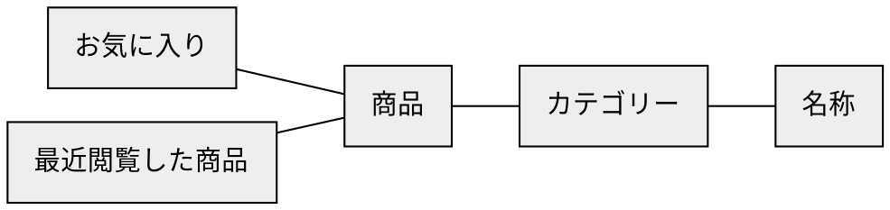
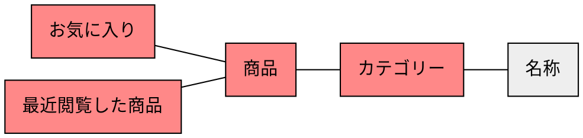
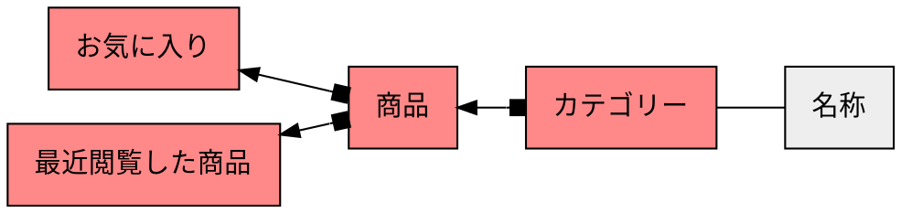
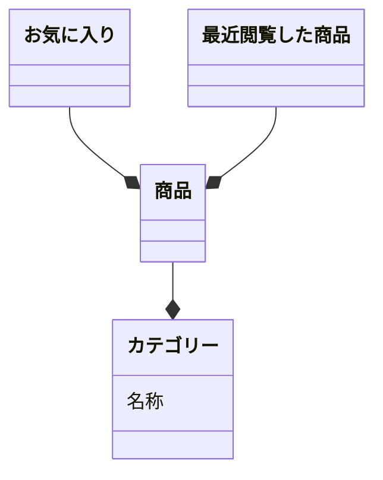

# ステップ1：オブジェクトの抽出

## タスクを揃える
- ある商品をお気に入りに追加する
- お気に入りの商品を確認する
- 最近閲覧した商品を確認する
- カテゴリーが「筆記用具」の商品を確認する


## 「名詞」を抽出する
- **ある商品**を**お気に入り**に追加する
- **お気に入り**の**商品**を確認する
- **最近閲覧した商品**を確認する
- **カテゴリー**が「**筆記用具**」の**商品**を確認する


## 「名詞」とそれらの関係を抽出する
``ある商品``ー``お気に入り``
``お気に入り``ー``商品``
``最近閲覧した商品``
``カテゴリー``ー``筆記用具``
``カテゴリー``ー``商品``


## 「名詞」を汎化し、粒度を揃える
``商品``ー``お気に入り``
``お気に入り``ー``商品``
``最近閲覧した商品``
``カテゴリー``ー``名称``
``カテゴリー``ー``商品``


## 「名詞」の関係性をつなげ、オブジェクトを特定する



## オブジェクトの中で「メインオブジェクト」になるものを特定する



## オブジェクトの多重性を特定する



## メインオブジェクトに付随するオブジェクトをプロパティとする



## タスクからアクションを見つける
```mermaid
classDiagram
  class 商品 {
    (追加)
    (削除)
  }
  class お気に入り {
    (追加)
    (削除)
  }
  class 最近閲覧した商品 {
    (追加)
    (削除)
  }
  class カテゴリー {
    名称
    (追加)
    (削除)
    (名称の変更)
  }
  お気に入り --* 商品
  最近閲覧した商品 --* 商品
  商品 --* カテゴリー
```
