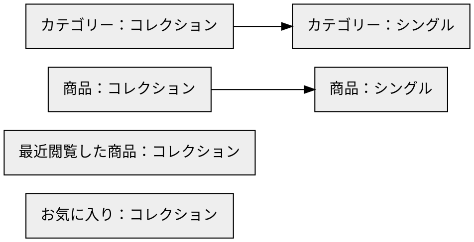
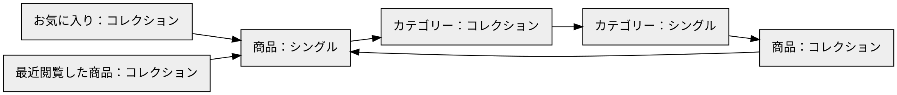

# ステップ2：ビューとナビゲーションの検討

## メインオブジェクトに「コレクション」と「シングル」のビューを与える

```dot
digraph {
  graph [
    rankdir = LR,
  ];
  node [
    shape = box,
    style = "filled",
    fillcolor = "#eeeeee",
    margin = 0.2
  ];

  お気に入り：コレクション;
  最近閲覧した商品：コレクション;
  商品：コレクション -> 商品：シングル [dir = forward];
  カテゴリー：コレクション -> カテゴリー：シングル [dir = forward];
}
```

## コレクションとシングルビューの呼び出し関係を検討する

```dot
digraph {
  graph [
    rankdir = LR,
  ];
  node [
    shape = box,
    style = "filled",
    fillcolor = "#eeeeee",
    margin = 0.2
  ];
  
  お気に入り：コレクション -> 商品：シングル [dir = forward];
  最近閲覧した商品：コレクション -> 商品：シングル [dir = forward];
  商品：コレクション -> 商品：シングル [dir = forward];
  カテゴリー：コレクション -> カテゴリー：シングル [dir = forward];
  カテゴリー：シングル -> 商品：コレクション [dir = forward];
  商品：シングル -> カテゴリー：コレクション [dir = forward];
}
```

## メインオブジェクトの中からルートナビゲーション項目を選定する
- お気に入り：コレクション
- 最近閲覧した商品：コレクション
