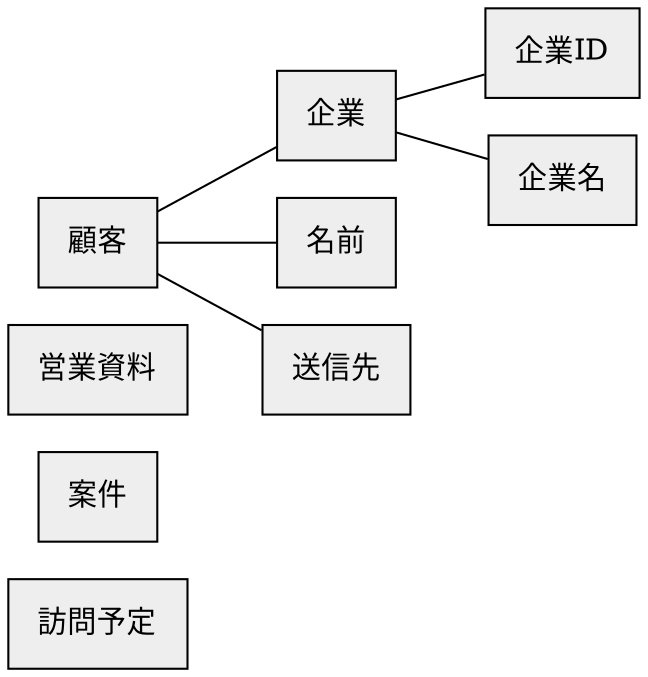
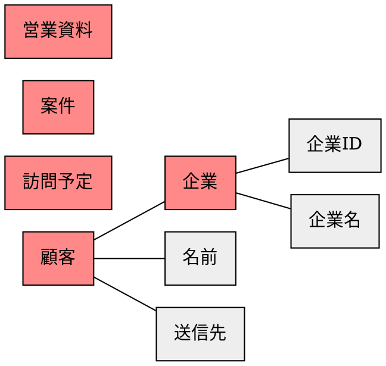
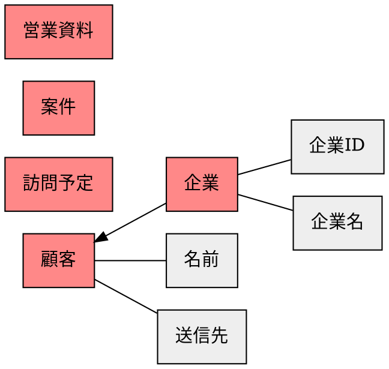
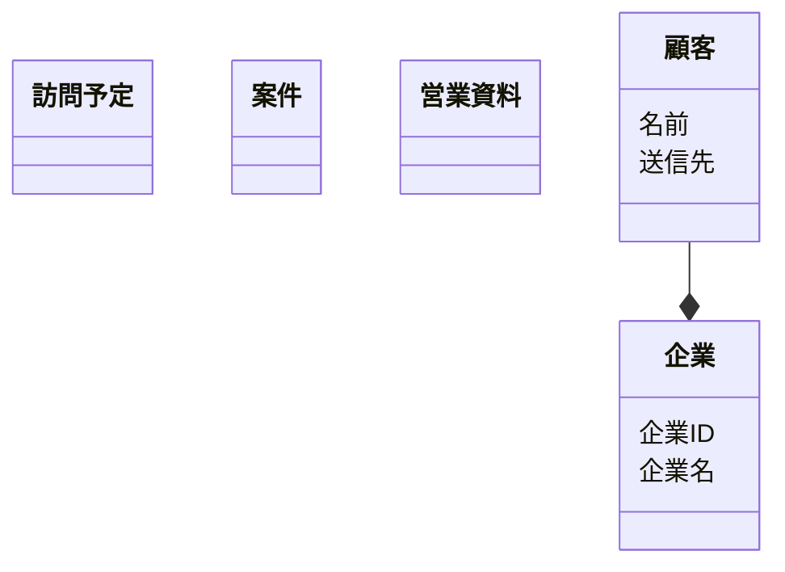

# ステップ1：オブジェクトの抽出

## 現行の画面内で用いられている名詞を拾い集める
- 営業支援
  - 訪問予定
  - 案件リスト
  - 案件検索
  - 顧客情報
    - 企業リスト
    - 企業検索
      - 企業ID
      - 企業名
    - 顧客データ入力
    - 顧客データインポート
    - 顧客データダウンロード
  - 顧客検索
  - 営業資料
  - 営業資料検索
  - 訪問予定検索
- さしすせそ株式会社
  - 企業情報
  - 顧客管理
    - 顧客作成
    - 顧客削除
    - 顧客詳細閲覧
    - 顧客詳細編集
    - 顧客メッセージ送信
      - 送信先


## 「名詞」を抽出する
- 営業支援
  - **訪問予定**
  - **案件**リスト
  - **案件**検索
  - **顧客**情報
    - **企業**リスト
    - **企業**検索
      - **企業ID**
      - **企業名**
    - **顧客**データ入力
    - **顧客**データインポート
    - **顧客**データダウンロード
  - **顧客**検索
  - **営業資料**
  - **営業資料**検索
  - **訪問予定**検索
- **さしすせそ株式会社**
  - **企業**情報
  - **顧客**管理
    - **顧客**作成
    - **顧客**削除
    - **顧客詳細**閲覧
    - **顧客詳細**編集
    - **顧客**メッセージ送信
      - **送信先**


## 「名詞」とそれらの関係を抽出する


## 「名詞」を汎化し、粒度を揃える
``訪問予定``
``案件``
``営業資料``
``企業``ー``企業ID``
``企業``ー``企業名``
``企業``ー``顧客``
``顧客``ー``名前``
``顧客``ー``送信先``


## 「名詞」の関係性をつなげ、オブジェクトを特定する



## オブジェクトの中で「メインオブジェクト」になるものを特定する



## オブジェクトの多重性を特定する



## メインオブジェクトに付随するオブジェクトをプロパティとする



## タスクからアクションを見つける
```mermaid
classDiagram
  class 訪問予定 {
  }
  class 案件 {
  }
  class 営業資料 {
  }
  class 顧客 {
    名前
    送信先
    (追加)
    (削除)
    (名前・送信先の変更)
  }
  class 企業 {
    企業ID
    企業名
    (追加)
    (削除)
    (企業名の変更)
  }
  顧客 --* 企業
```
