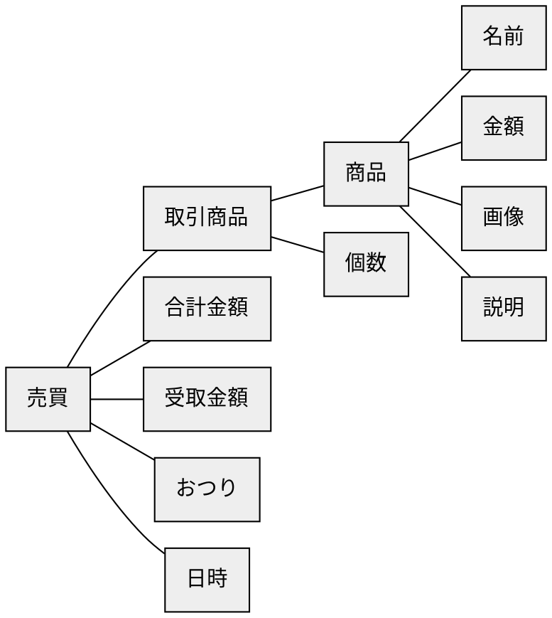
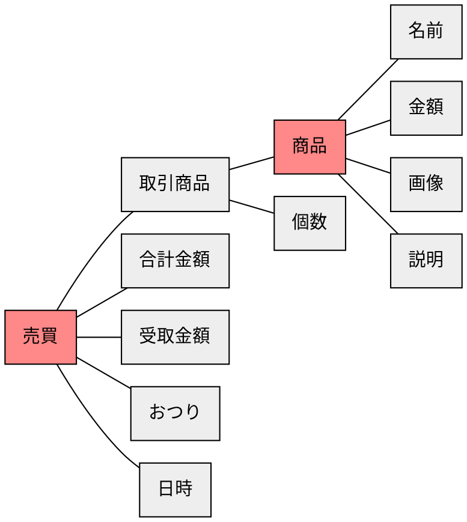
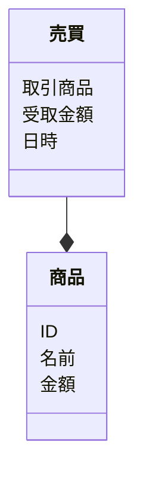

# ステップ1：オブジェクトの抽出

## タスクを揃える
- 商品を登録する
- 売買する商品を指定する
- 商品の名前と金額を設定する
- 売買する商品の合計金額を算出する
- 売買で受け取った金額を設定する
- 売買のおつりを算出する
- 売買の日時を設定する
- 商品の画像を登録する
- 商品の説明を登録する


## 「名詞」を抽出する
- **商品**を登録する
- **売買**する**商品**と**個数**を指定する
- **商品**の**名前**と**金額**を設定する
- **売買**の**合計金額**を算出する
- **売買**の**受取金額**を設定する
- **売買**の**おつり**を算出する
- **売買**の**日時**を設定する
- **商品**の**画像**を登録する
- **商品**の**説明**を登録する


## 「名詞」とそれらの関係を抽出する
``売買``-``商品``-``個数``
``商品``-``名前``
``商品``-``金額``
``商品``-``画像``
``商品``-``説明``
``売買``-``合計金額``
``売買``-``受取金額``
``売買``-``おつり``
``売買``-``日時``


## 「名詞」を汎化し、粒度を揃える
``売買``-``取引商品``-``個数``
``商品``-``名前``
``商品``-``金額``
``商品``-``画像``
``商品``-``説明``
``売買``-``合計金額``
``売買``-``受取金額``
``売買``-``おつり``
``売買``-``日時``


## 「名詞」の関係性をつなげ、オブジェクトを特定する



## オブジェクトの中で「メインオブジェクト」になるものを特定する



## オブジェクトの多重性を特定する


## メインオブジェクトに付随するオブジェクトをプロパティとする



## タスクからアクションを見つける
```mermaid
classDiagram
  class 商品 {
    ID
    名前
    金額
    画像
    説明
    (商品を管理する)
  }
  class 売買 {
    取引商品
    受取金額
    日時
    (売買を管理する)
    (合計金額を算出する)
    (おつりを算出する)
  }
  売買 --* 商品
```


## その他
作成完了後、下記の追加対応
- 売買に「値引き」を設定できるようにする
- 商品に「カテゴリー」を設定できるようにする
- 商品に「在庫」を設定できるようにする
- お客さんに表示するページ作成（※在庫がある かつ お客さんに見せる設定 されている商品を表示）
