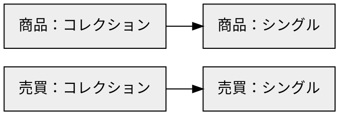
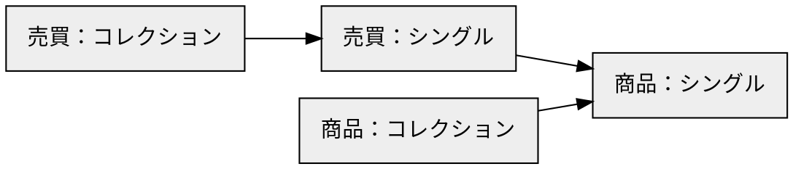

# ステップ2：ビューとナビゲーションの検討

## メインオブジェクトに「コレクション」と「シングル」のビューを与える

```dot
digraph {
  graph [
    rankdir = LR,
  ];
  node [
    shape = box,
    style = "filled",
    fillcolor = "#eeeeee",
    margin = 0.2
  ];

  売買：コレクション -> 売買：シングル [dir = forward];
  商品：コレクション -> 商品：シングル [dir = forward];
}
```

## コレクションとシングルビューの呼び出し関係を検討する

```dot
digraph {
  graph [
    rankdir = LR,
  ];
  node [
    shape = box,
    style = "filled",
    fillcolor = "#eeeeee",
    margin = 0.2
  ];

  売買：コレクション -> 売買：シングル [dir = forward];
  売買：シングル -> 商品：シングル [dir = forward];
  商品：コレクション -> 商品：シングル [dir = forward];
}
```

## メインオブジェクトの中からルートナビゲーション項目を選定する
- 売買：新規登録
- 売買：コレクション
- 商品：コレクション
