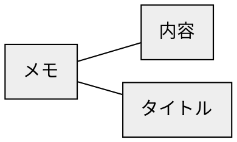
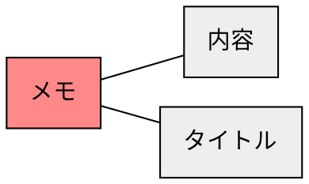
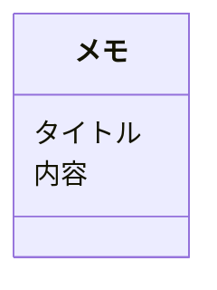

# ステップ1：オブジェクトの抽出

## タスクを揃える
- メモを確認する
- あるメモの内容を確認する
- あるメモの内容を変更する
- あるメモのタイトルを変更する
- あるタイトルのメモの内容を変更する
- あるメモを削除する
- メモを新規作成する


## 「名詞」を抽出する
- **メモ**を確認する
- **あるメモ**の**内容**を確認する
- **あるメモ**の**内容**を変更する
- **あるメモ**の**タイトル**を変更する
- **あるタイトル**の**メモ**の内容を変更する
- **あるメモ**を削除する
- **メモ**を新規作成する


## 「名詞」とそれらの関係を抽出する
``メモ``
``あるメモ``ー``内容``
``あるメモ``ー``内容``
``あるメモ``ー``タイトル``
``あるタイトル``ー``メモ``
``あるメモ``
``メモ``


## 「名詞」を汎化し、粒度を揃える
``メモ``
``メモ``ー``内容``
``メモ``ー``内容``
``メモ``ー``タイトル``
``タイトル``ー``メモ``
``メモ``
``メモ``


## 「名詞」の関係性をつなげ、オブジェクトを特定する



## オブジェクトの中で「メインオブジェクト」になるものを特定する



## オブジェクトの多重性を特定する


## メインオブジェクトに付随するオブジェクトをプロパティとする



## タスクからアクションを見つける
```mermaid
classDiagram
  class メモ {
    タイトル
    内容
    (変更)
    (確認)
    (削除)
    (新規)
  }
```
