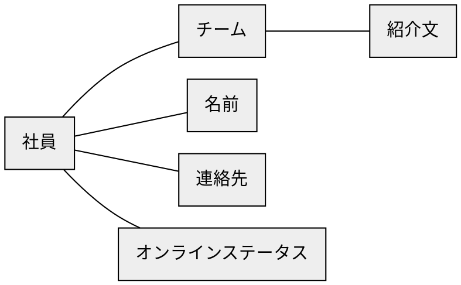
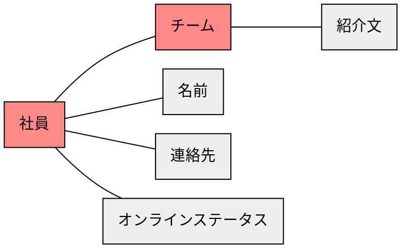
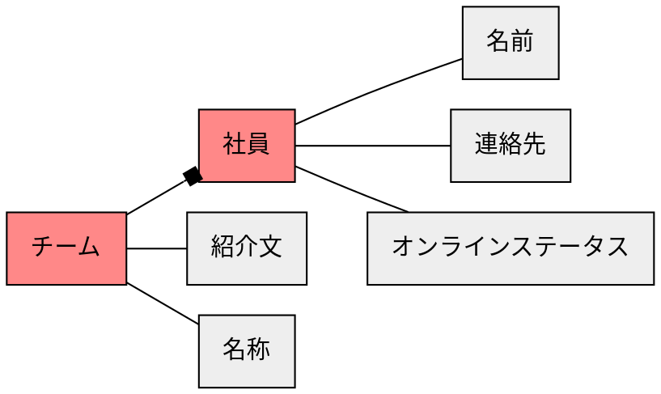
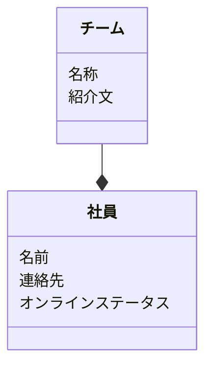

# ステップ1：オブジェクトの抽出

## タスクを揃える
- 野坂さんの所属チームを確認する
- 西村さんをファイナンスチームに追加する
- 横田さんをデザインチームから削除する
- マーケティングチームの社員を確認する
- 社員を新規登録する
- 城之内さんのオンラインステータスを確認する
- エンジニアリングチームの紹介文を確認する
- 田坂さんの連絡先を確認する


## 「名詞」を抽出する
- **野坂さん**の**所属チーム**を確認する
- **西村さん**を**ファイナンスチーム**に追加する
- **横田さん**を**デザインチーム**から削除する
- **マーケティングチーム**の**社員**を確認する
- **社員**を新規登録する
- **城之内さん**の**オンラインステータス**を確認する
- **エンジニアリングチーム**の**紹介文**を確認する
- **田坂さん**の**連絡先**を確認する


## 「名詞」とそれらの関係を抽出する
``野坂さん``ー``所属チーム``
``西村さん``ー``ファイナンスチーム``
``横田さん``ー``デザインチーム``
``マーケティングチーム``ー``社員``
``社員``
``城之内さん``ー``オンラインステータス``
``エンジニアリングチーム``ー``紹介文``
``田坂さん``ー``連絡先``


## 「名詞」を汎化し、粒度を揃える
``社員``ー``チーム``
``社員``ー``チーム``
``社員``ー``チーム``
``チーム``ー``社員``
``社員``
``社員``ー``オンラインステータス``
``チーム``ー``紹介文``
``社員``ー``連絡先``


## 「名詞」の関係性をつなげ、オブジェクトを特定する



## オブジェクトの中で「メインオブジェクト」になるものを特定する



## オブジェクトの多重性を特定する



## メインオブジェクトに付随するオブジェクトをプロパティとする



## タスクからアクションを見つける
```mermaid
classDiagram
  class チーム {
    名称
    紹介文
    (メンバー追加)
    (メンバー削除)
    (新規)
    (削除)
    (名称変更)
    (紹介文変更)
  }
  class 社員 {
    名前
    連絡先
    オンラインステータス
    (新規)
    (削除)
    (登録チーム変更)
    (名前変更)
    (連絡先変更)
    (オンラインステータス変更)
  }
  チーム --* 社員
```
