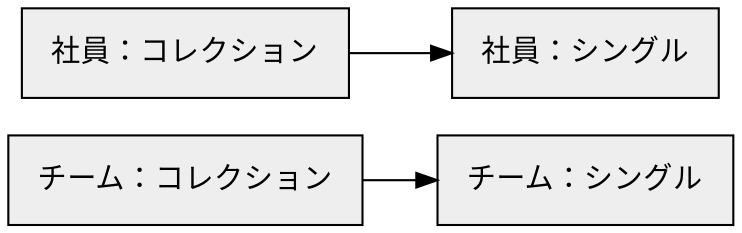
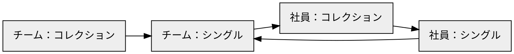

# ステップ2：ビューとナビゲーションの検討

## メインオブジェクトに「コレクション」と「シングル」のビューを与える

```dot
digraph {
  graph [
    rankdir = LR,
  ];
  node [
    shape = box,
    style = "filled",
    fillcolor = "#eeeeee",
    margin = 0.2
  ];

  チーム：コレクション -> チーム：シングル [dir = forward];
  社員：コレクション -> 社員：シングル [dir = forward];
}
```

## コレクションとシングルビューの呼び出し関係を検討する

```dot
digraph {
  graph [
    rankdir = LR,
  ];
  node [
    shape = box,
    style = "filled",
    fillcolor = "#eeeeee",
    margin = 0.2
  ];

  チーム：コレクション -> チーム：シングル [dir = forward];
  チーム：シングル -> 社員：コレクション [dir = forward];
  社員：コレクション -> 社員：シングル [dir = forward];
  社員：シングル -> チーム：シングル [dir = forward];
}
```

## メインオブジェクトの中からルートナビゲーション項目を選定する
- チーム：コレクション
- 社員：コレクション
